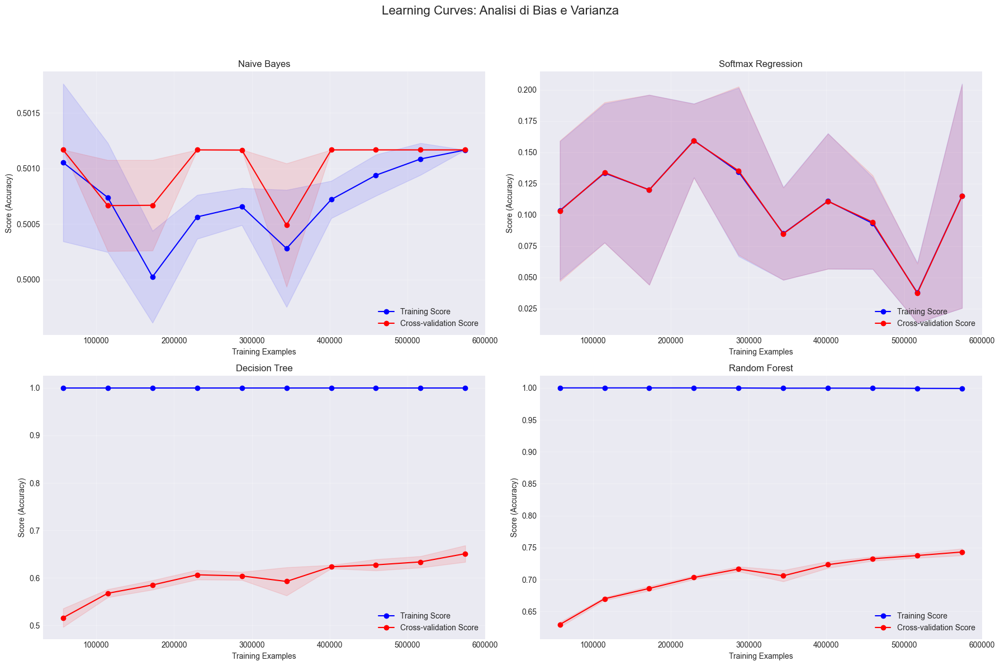

# Poker Hand Classification

A comparative study of supervised classifiers on the UCI **Poker Hand** dataset
(1,025,010 instances, 10 features, 10 classes), done for the Machine Learning
course at Sapienza.

**The interesting result is not the best accuracy — it is the trade-off.**
A regularised Random Forest scores *lower* raw accuracy than an unconstrained one
(68.9% vs 75.9%), but raises balanced accuracy from 0.25 to 0.40 and macro F1 from 0.28 to 0.37. On a dataset where
classes 0 and 1 are over 90% of the data, raw accuracy mostly measures how well a
model predicts "nothing in hand".

## Results

| Model | Accuracy | Balanced accuracy | Macro F1 |
| --- | --- | --- | --- |
| Gaussian Naive Bayes | 1.3% | 0.10 | 0.01 |
| Logistic Regression (softmax) | 7.7% | — | 0.04 |
| Decision Tree | 66.0% | — | 0.25 |
| Random Forest | 75.9% | 0.25 | 0.28 |
| Random Forest, regularised (`max_depth=20`, `min_samples_leaf=10`) | 68.9% | 0.40 | 0.37 |

The linear and probabilistic baselines collapse: card suit and rank carry no linear
signal about the hand they form, and Naive Bayes' independence assumption throws
away exactly what defines a hand, the relations between cards. Their accuracy even
falls below the ~50% of a model that always answers "nothing in hand": with
`class_weight='balanced'` the rare classes (a royal flush appears 8 times in a
million) are weighted up by several orders of magnitude, so a model with no real
signal spreads its predictions across them and gives up the majority classes. Tree models pick up the non-linear structure but overfit towards the
majority classes. Constraining depth and leaf size is what buys back the rare hands.

<p align="center">
  
</p>

Training F1 falls from 0.91 to 0.85 as data grows while validation F1 rises from 0.21
to 0.33 — the gap narrows, which is the shape you want to see.

## Method

- Stratified split: 70% train / 15% validation / 15% test
- `StandardScaler` on the features, `class_weight='balanced'` for the imbalance
- Metrics: precision, recall, F1 per class, plus balanced accuracy and macro F1,
  since plain accuracy is misleading on this distribution

## Limitations

- **The problem is deterministic.** The class is a fixed function of the five
  cards, so the ceiling is 100%. The models here work on the raw encoding (suit and
  rank of each card, in arbitrary order), which hides that structure. Features that
  do not depend on card order (counts of each rank and suit, sorted ranks, gaps
  between consecutive ranks) would make the task close to trivial.
- **Suits are nominal.** Encoding them as 1–4 and scaling them imposes an order
  that does not exist; one-hot encoding would be more appropriate, at least for the
  linear model.
- **`StandardScaler` does nothing for the trees.** Tree-based models are invariant
  to monotonic transformations of the features; scaling only matters for logistic
  regression and Naive Bayes.
- **Hyperparameters were tuned on accuracy.** Grid search used
  `scoring='accuracy'`, which favours the majority classes; tuning on balanced
  accuracy or macro F1 would be more consistent with the conclusions above.

## Repository

```
notebooks/01_data_exploration.ipynb   dataset loading and class distribution
notebooks/02_model_comparison.ipynb   preprocessing, training, evaluation
figures/                              confusion matrices, feature importance, learning and ROC curves
```

## Running it

```bash
pip install ucimlrepo scikit-learn pandas matplotlib seaborn
jupyter notebook notebooks/01_data_exploration.ipynb
```

The dataset is downloaded at runtime from the UCI repository (`fetch_ucirepo(id=158)`),
so there is nothing to download by hand.

## Author

Fabrizio Pietrobono — MSc Computer Science & AI, Sapienza Università di Roma.
Individual project.

[LinkedIn](https://www.linkedin.com/in/fabriziopietrobono)
